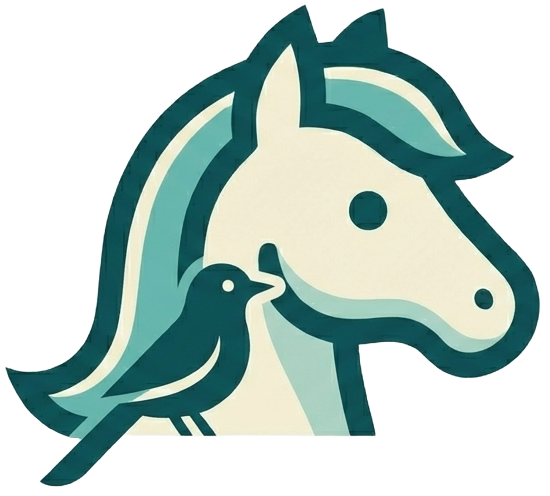

<p align="center">
  
</p>

<h1 align="center">Wagtail Starter Template</h1>

A production-ready [Wagtail](https://wagtail.org/) CMS starter template for [Railway](https://railway.com).

[](https://railway.com/deploy/wagtail-starter-template?referralCode=iZa9TM&utm_medium=integration&utm_source=template&utm_campaign=generic)

## Deploy to Railway

Click the button above to deploy this template. Railway will:

1. Create a new Wagtail web service
2. Provision a PostgreSQL database
3. Set `DATABASE_URL` and `SECRET_KEY` automatically
4. Run migrations on deploy (includes a default home page)
5. Start the application with gunicorn

Your site will be live in under a minute. Create a superuser via `railway run python manage.py createsuperuser` to access the Wagtail admin at `/admin/`.

### Environment variables

These are set automatically by Railway. Override them in your service settings if needed:

| Variable | Description | Default |
|----------|-------------|---------|
| `SECRET_KEY` | Django secret key | Auto-generated |
| `DATABASE_URL` | PostgreSQL connection string | Provided by Railway |
| `ALLOWED_HOSTS` | Comma-separated hostnames | `.railway.app` |
| `CSRF_TRUSTED_ORIGINS` | Full URLs for POST requests (e.g. `https://myapp.up.railway.app`) | `[]` |
| `WAGTAIL_SITE_NAME` | Site name shown in Wagtail admin | `Wagtail Starter` |
| `WAGTAILADMIN_BASE_URL` | Full URL of the site | Your Railway URL |
| `DJANGO_SETTINGS_MODULE` | Settings module | `config.settings.production` |

**Important:** If you add a custom domain, add it to both `ALLOWED_HOSTS` and `CSRF_TRUSTED_ORIGINS` (with `https://` prefix). Without `CSRF_TRUSTED_ORIGINS`, POST requests (login, admin, forms) will return 403.

### Media storage

Railway has no persistent disk. Media uploads (images, documents) work locally but are lost on redeploy. For production, configure S3-compatible storage (AWS S3, Cloudflare R2, etc.). See the commented-out example in `config/settings/production.py`.

## Local Development

### Option A: uv (recommended)

Prerequisites: [Python 3.12+](https://python.org), [uv](https://docs.astral.sh/uv/getting-started/installation/)

```bash
git clone https://github.com/fasouto/wagtail-starter-template.git
cd wagtail-starter-template

# Install dependencies
uv sync --dev

# Set up environment
cp .env.example .env

# Run migrations (creates a default home page)
uv run python manage.py migrate

# Create admin user
uv run python manage.py createsuperuser

# Start development server
uv run python manage.py runserver
```

Open [http://localhost:8000](http://localhost:8000). The Wagtail admin is at [http://localhost:8000/admin/](http://localhost:8000/admin/).

```bash
# Run tests
uv run pytest

# Lint and format
uv run ruff check .
uv run ruff format .
```

### Option B: Docker Compose

Prerequisites: [Docker](https://docs.docker.com/get-docker/)

```bash
git clone https://github.com/fasouto/wagtail-starter-template.git
cd wagtail-starter-template

cp .env.example .env

# Start Wagtail + PostgreSQL
docker compose up

# In another terminal:
docker compose exec web uv run python manage.py migrate
docker compose exec web uv run python manage.py createsuperuser
```

Open [http://localhost:8000](http://localhost:8000). Code changes reload automatically.

## Project Structure

```
.
├── apps/
│   └── home/                # Home page app (Wagtail Page model)
│       ├── migrations/      # Includes data migration for default page
│       ├── templates/home/  # Page templates
│       ├── models.py        # HomePage model
│       └── tests.py
├── config/                  # Django project package
│   ├── settings/
│   │   ├── base.py          # Shared settings (includes Wagtail config)
│   │   ├── development.py   # Dev settings (DEBUG=True, SQLite)
│   │   └── production.py    # Production settings (Postgres, security, S3)
│   ├── static/              # Project-level static files
│   │   └── css/base.css
│   ├── templates/           # Project-level templates (base.html, error pages)
│   ├── urls.py              # URL routing (Wagtail admin, Django admin, health)
│   ├── asgi.py
│   └── wsgi.py
├── docker-compose.yml       # Local dev with Docker (Wagtail + Postgres)
├── Dockerfile.dev           # Dev container
├── pyproject.toml           # Dependencies and tool config
├── railway.toml             # Railway deployment config
└── manage.py
```

## What's Included

- **[Wagtail 7.0 LTS](https://docs.wagtail.org/)**: powerful CMS built on Django, supported until April 2028
- **[Django 5.2 LTS](https://docs.djangoproject.com/en/5.2/)**: supported until April 2028
- **[PostgreSQL](https://www.postgresql.org/)** via psycopg3, modern async-capable adapter
- **[WhiteNoise](https://whitenoise.readthedocs.io/)**: serve static files without nginx, with brotli compression
- **[django-environ](https://django-environ.readthedocs.io/)**: configure via environment variables and `.env` files
- **[Argon2](https://docs.djangoproject.com/en/5.2/topics/auth/passwords/#using-argon2-with-django)** password hashing (winner of the Password Hashing Competition)
- **Split settings** for separate development and production configurations
- **Health check** at `/health/`, returns JSON for Railway monitoring
- **[django-debug-toolbar](https://django-debug-toolbar.readthedocs.io/)**: SQL queries, templates, cache inspection (dev only)
- **[ruff](https://docs.astral.sh/ruff/)** for linting and formatting
- **[pytest](https://docs.pytest.org/) + [pytest-django](https://pytest-django.readthedocs.io/)** for testing

## Customization

### Adding a new page type

Create a new model in `apps/home/models.py` or a new app:

```python
from wagtail.models import Page
from wagtail.fields import RichTextField
from wagtail.admin.panels import FieldPanel


class BlogPage(Page):
    body = RichTextField()

    content_panels = Page.content_panels + [
        FieldPanel("body"),
    ]
```

Then run `uv run python manage.py makemigrations && uv run python manage.py migrate`.

### Replacing the CSS

The included `config/static/css/base.css` is minimal and framework-free. Replace it with Bootstrap, Tailwind, or any CSS framework you prefer.

### Adding Celery

Add `celery[redis]` to your dependencies, create `config/celery.py`, and add a Redis service to your Railway project or `docker-compose.yml`.

## License

MIT. See [LICENSE](LICENSE).
